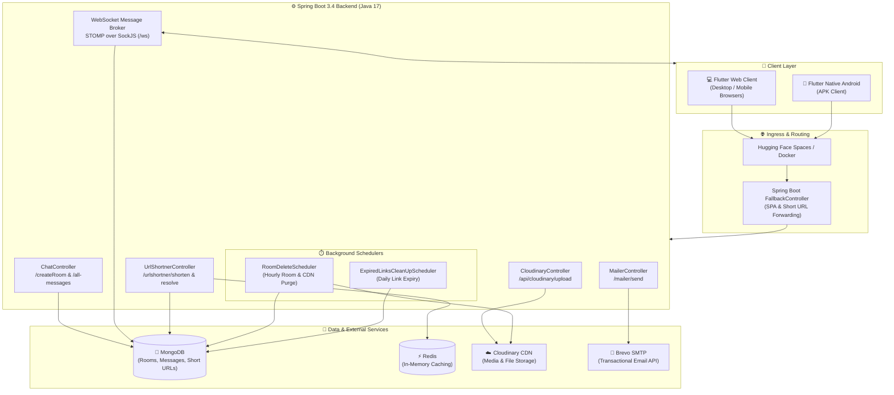
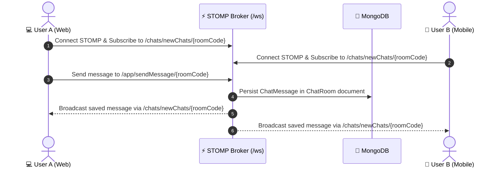

<div align="center">

  

  # Batchshare 🚀

  **Seamless, Real-Time Cross-Device Text & File Sharing Platform with Smart URL Shortener & Email Dispatch**

  [](https://www.oracle.com/java/)
  [](https://spring.io/projects/spring-boot)
  [](https://flutter.dev/)
  [](https://dart.dev/)
  [](https://www.mongodb.com/)
  [](https://redis.io/)
  [](https://www.docker.com/)
  [](https://adityx10-batchshare.hf.space)
  [](LICENSE)

  <br />

  <p align="center">
    <a href="https://adityx10-batchshare.hf.space"><b>🌐 Try Live Web App</b></a> •
    <a href="https://drive.google.com/uc?export=download&id=1swGE-w1Li7W7tZHhaf4mPjPPMIHlMN_H"><b>📱 Download Android APK</b></a> •
    <a href="#-key-features"><b>✨ Features</b></a> •
    <a href="#️-system-architecture"><b>🏗️ Architecture</b></a> •
    <a href="#-api--websocket-reference"><b>🔌 API Docs</b></a> •
    <a href="#️-getting-started"><b>⚙️ Getting Started</b></a>
  </p>

</div>

---

## 📖 Overview

Have you ever needed to send a long code snippet, text block, link, or photo from your computer to your phone (or to a coworker sitting across the room) without logging into personal social media accounts, messengers, or email clients on shared devices?

**Batchshare** bridges this gap effortlessly. It is an ephemeral, zero-friction sharing hub that synchronizes text, code, and files in real-time across devices via temporary room codes. In addition to peer-to-peer real-time sync, Batchshare includes a powerful **vanity URL shortener** with custom TTL expiration, an **email dispatch utility** (powered by Brevo SMTP), and **automated background cleanup schedulers** to keep storage lean and secure.

---

## ✨ Key Features

| Feature | Description |
| :--- | :--- |
| ⚡ **Real-Time Room Sync** | Create instant ephemeral rooms with a 6-digit PIN. Any text, code, or file uploaded is broadcast live to all connected devices via WebSockets (SockJS + STOMP). |
| 📁 **Cloudinary File Attachments** | Instant upload of images, PDFs, archives, and documents (up to 10MB) backed by Cloudinary CDN with direct preview and download links. |
| 🔗 **Smart URL Shortener** | Shorten URLs with custom vanity slugs and configurable expiration periods (1 to 30 days). Includes automated background expiry cleanup. |
| ✉️ **Integrated Mailer Service** | Broadcast shared snippets, links, and file attachments directly to recipient email lists in a single click using Brevo (Sendinblue) SMTP. |
| 🧹 **Automated Lifecycle Schedulers** | Expired rooms and their associated Cloudinary files are automatically purged every hour. Expired short links are deleted daily. |
| 📱 **Cross-Platform Client** | Premium dark-mode glassmorphic interface built with Flutter, compiled for **Web** (SPA) and **Native Android** (APK) with responsive layouts. |
| 🔄 **SPA Fallback Routing** | Spring Boot controller routing that forwards vanity short codes and SPA routes directly to `index.html` for client-side resolution. |

---

## 🏗️ System Architecture



### Real-Time WebSocket Synchronization Flow



---

## 🌿 Multi-Branch Repository Structure

This repository uses dedicated branches to separate backend services from frontend applications while maintaining a single, unified codebase:

```
batchshare (Repository)
├── 🌿 main         👉 Central documentation, architectural blueprints, deployment guides
├── 🌿 backend      👉 Spring Boot 3.4 Java backend, Docker configs, build scripts, static assets
└── 🌿 frontend     👉 Flutter client application (Web & Android source code, BLoC state)
```

| Branch | Primary Purpose | Tech Stack |
| :--- | :--- | :--- |
| **`main`** | Default GitHub landing page, system specs, architectural overview, live links | Markdown, Mermaid |
| **`backend`** | REST endpoints, WebSocket broker, schedulers, MongoDB/Redis integration, Dockerfile | Java 17, Spring Boot 3.4, Maven |
| **`frontend`** | Responsive UI, state management, WebSocket client, Web/Android builds | Flutter 3.x, Dart, flutter_bloc |

---

## 🛠️ Technology Stack

### Backend
- **Framework**: Spring Boot `3.4.11` (Java 17)
- **Messaging & Sockets**: Spring WebSocket, SockJS, STOMP Protocol
- **Databases**: MongoDB (Spring Data MongoDB) & Redis (Spring Data Redis)
- **File Storage**: Cloudinary Java SDK (`1.39.0`)
- **Email Service**: Spring Boot Mail + Brevo SMTP
- **Utilities**: Lombok, Spring DotEnv (`4.0.0`), Jackson JSR310

### Frontend
- **Framework**: Flutter `3.x` (Dart SDK `^3.9.2`)
- **State Management**: `flutter_bloc` (`^9.1.1`), `get` (`^4.7.3`), `equatable`
- **Network & Sockets**: `dio` (`^5.9.1`), `stomp_dart_client` (`^3.0.1`), `web_socket_channel`
- **UI & UX**: `pinput` (6-digit PIN input), `clipboard`, `file_picker`, `simple_gradient_text`, `blobs`
- **Cloud Delivery**: `cloudinary_flutter`

### DevOps & Infrastructure
- **Containerization**: Docker & Docker Compose
- **Hosting**: Hugging Face Spaces (Backend + Static Web App)
- **Static Hosting**: Firebase Hosting / Spring Boot Embedded Tomcat
- **Mobile Distribution**: Android Release APK

---

## 🔌 API & WebSocket Reference

### 1. Room & Chat Management

| Method | Endpoint | Description |
| :--- | :--- | :--- |
| `GET` | `/createRoom` | Generates a new ephemeral room with a unique code (expires in 1 hour). |
| `GET` | `/all-messages/{chatCode}` | Fetches message history for the given room code. |
| `GET` | `/expiry` | Lists active room metadata and expiration timestamps. |

#### WebSocket STOMP Protocol
- **STOMP Endpoint**: `/ws` (with SockJS fallback)
- **Subscribe Destination**: `/chats/newChats/{chatRoomId}`
- **Send Destination**: `/app/sendMessage/{chatRoomId}`

```json
// WebSocket Message Payload
{
  "sentBy": "User1",
  "message": "Hello from Flutter!",
  "type": "TEXT",
  "urls": [],
  "publicId": []
}
```

### 2. URL Shortener

| Method | Endpoint | Description |
| :--- | :--- | :--- |
| `POST` | `/urlshortner/shorten` | Creates a short URL with optional custom slug and TTL (in days). |
| `GET` | `/urlshortner/exists/{code}` | Checks if a given short code exists and is valid. |
| `GET` | `/urlshortner/resolve/{code}` | Resolves the short code to its original destination URL. |

```json
// POST /urlshortner/shorten Request
{
  "originalUrl": "https://example.com/very/long/url/to/shorten",
  "customCode": "my-custom-link",
  "expiryDays": 7
}

// Response (200 OK)
{
  "originalUrl": "https://example.com/very/long/url/to/shorten",
  "shortenedUrl": "https://adityx10-batchshare.hf.space/my-custom-link",
  "expiresAt": "2026-09-20T12:00:00"
}
```

### 3. File Uploads (Cloudinary)

| Method | Endpoint | Description |
| :--- | :--- | :--- |
| `POST` | `/api/cloudinary/upload` | Multipart file upload returning secure CDN URL and Cloudinary public ID. |

### 4. Mailer Service

| Method | Endpoint | Description |
| :--- | :--- | :--- |
| `POST` | `/mailer/send` | Dispatches shared messages, files, and URLs to recipient email addresses. |

```json
// POST /mailer/send Request
{
  "name": "Alex",
  "mails": ["recipient1@example.com", "recipient2@example.com"],
  "messages": ["Check out the design specifications"],
  "urls": ["https://res.cloudinary.com/.../document.pdf"],
  "fileNames": ["document.pdf"]
}
```

### 5. Health Check

| Method | Endpoint | Description |
| :--- | :--- | :--- |
| `GET` | `/healthcheck` | Returns `okay` if the backend server is running properly. |

---

## ⚙️ Getting Started

### Prerequisites
- **Java**: JDK 17 or higher
- **Maven**: 3.8+ (or use bundled `./mvnw`)
- **Flutter SDK**: 3.x+
- **Docker & Docker Compose** (Optional, recommended for quick local setup)
- **MongoDB** & **Redis** instances (or Docker containers)

---

### 🐳 Quick Start with Docker Compose

Spin up Redis and the Spring Boot application in a single command:

```bash
# Clone the repository
git clone https://github.com/aditya-10k/batchshare.git
cd batchshare

# Switch to the backend branch
git checkout backend

# Launch services
docker-compose up -d --build
```

---

### 🖥️ Local Backend Setup

1. **Checkout Backend Branch**:
   ```bash
   git checkout backend
   ```

2. **Configure Environment Variables**:
   Create a `.env` file in the root of the backend folder:
   ```env
   # MongoDB
   SPRING_DATA_MONGO_URI=mongodb://localhost:27017/batchshare

   # Redis
   SPRING_DATA_REDIS_HOST=localhost
   SPRING_DATA_REDIS_PORT=6379

   # Cloudinary
   CLOUDINARY_CLOUDNAME=your_cloudinary_cloud_name
   CLOUDINARY_API_KEY=your_cloudinary_api_key
   CLOUDINARY_API_SECRET=your_cloudinary_api_secret

   # Brevo (Sendinblue) SMTP
   BREVO_SMTP_HOST=smtp-relay.brevo.com
   BREVO_SMTP_PORT=587
   BREVO_SMTP_USERNAME=your_brevo_smtp_login
   BREVO_SMTP_PASSWORD=your_brevo_smtp_password
   BREVO_EMAIL_FROM=no-reply@batchshare.com

   # Application Base URL
   BASE_URL=http://localhost:8080/
   ```

3. **Build and Run**:
   ```bash
   ./mvnw clean spring-boot:run
   ```
   The backend will start at `http://localhost:8080`.

---

### 📱 Local Frontend Setup (Flutter)

1. **Checkout Frontend Branch**:
   ```bash
   git checkout frontend
   cd TextShareFrontend/textshare
   ```

2. **Install Dependencies**:
   ```bash
   flutter pub get
   ```

3. **Run on Web**:
   ```bash
   flutter run -d chrome
   ```

4. **Build Android APK**:
   ```bash
   flutter build apk --release
   ```
   The generated APK will be located at `build/app/outputs/flutter-apk/app-release.apk`.

---

### 🔄 Automated Build & Bundle Script

A PowerShell pipeline script (`build_and_copy.ps1`) automates compiling the Flutter web client and injecting it directly into the Spring Boot backend's static resource directory:

```powershell
# Executes Flutter Web release build and copies static assets to Spring Boot resources
.\build_and_copy.ps1
```

This ensures single-container deployments (such as Hugging Face Spaces) serve both the REST API and the Flutter Web UI from the same host.

---

## ⏱️ Background Schedulers

| Scheduler | Frequency | Target | Action |
| :--- | :--- | :--- | :--- |
| **`RoomDeleteScheduler`** | Every 1 Hour (`fixedRate = 3600000`) | `ChatRoom` | Deletes rooms older than 1 hour and purges their uploaded files from Cloudinary via API. |
| **`ExpiredLinksCleanUpScheduler`** | Every 24 Hours (`fixedRate = 86400000`) | `UrlMapping` | Removes expired short links from MongoDB whose `expiresAt` timestamp is before `now()`. |

---

## 🤝 Contributing

Contributions, issues, and feature requests are welcome!

1. Fork the Project
2. Create your Feature Branch (`git checkout -b feature/AmazingFeature`)
3. Commit your Changes (`git commit -m "feat: add AmazingFeature"`)
4. Push to the Branch (`git push origin feature/AmazingFeature`)
5. Open a Pull Request

---

## 📄 License

This project is licensed under the [MIT License](LICENSE) - see the LICENSE file for details.

<div align="center">
  <sub>Built with ❤️ by <a href="https://github.com/aditya-10k">Aditya Kathe</a></sub>
</div>
